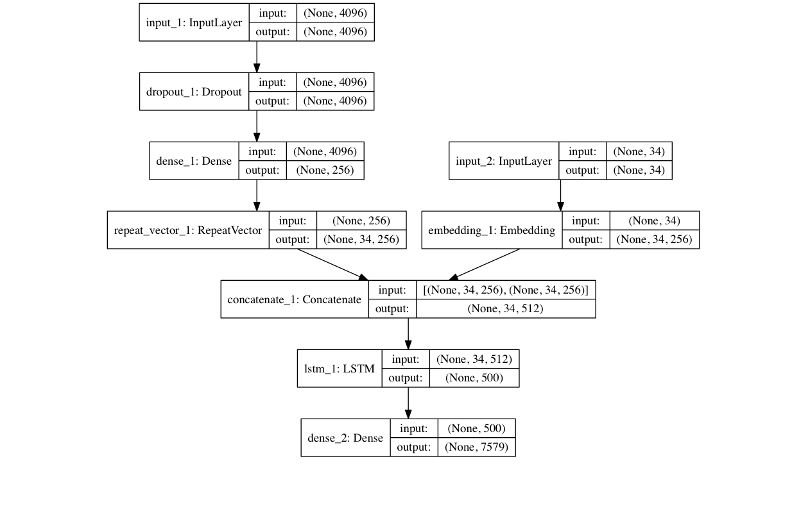

# Online-Class-Note-Maker
Recruitment Project for 2nd year.

System that generates summarised text for the text available in literary form of study materials like pdf, etc along with natural language captions for any image.

## Dataset
The image captioning model is trained on [Flickr8k Dataset](https://illinois.edu/fb/sec/1713398)

## Model

    

## Performance
The model has been trained for 20 epoches on 6000 training samples of Flickr8k Dataset.

----------------------------------

## Requirements
- Python 3.6
- sumy 
- pdfplumber
- fitz
- tensorflow
- pillow
- matplotlib
- h5py
- keras
- numpy
- pydot
- nltk
- progressbar2
- pytesseract
- PyPDF2
- io

These requirements can be easily installed by:
  `pip install -r requirements.txt`

## Scripts

- __main.py__: This is the main file which combines all the other scripts to output the required info.
- __caption.py__: This script contains the model for image captioning and returns image caption for a particular input image.
- __summarizer.py__: This script contains all the necessary functions to summarize the text obtained from the pdf.

## Usage

### From scratch
After the requirements have been installed, the process from training to testing is fairly easy. The commands to run:
1. Upload the pdf which is required to be summarised in the main directory.
2. Update the path of the pdf in the main.py script.
3. Update all the paths in the caption.py script from line 40 to 44 accordingly.
4. Run the main.py script.

Hurrah!! You have got yourself some notes compiled from provided pdf along with captioned images! 
